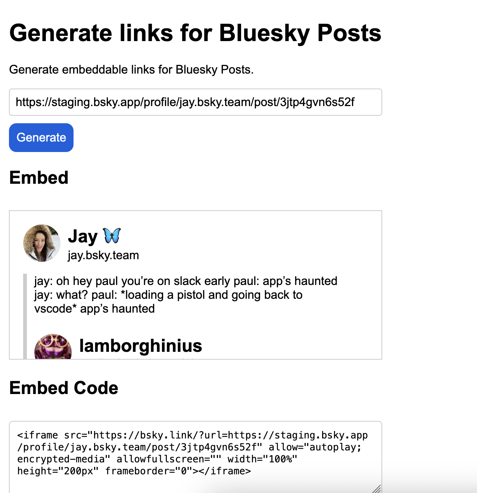

# Bluesky Link Preview

Generate permalinks to Bluesky posts that you can embed in a website.

Posts are not cached. This means that if a post becomes unavailable or private, the link will no longer work.

Text posts, posts with embedded posts, and posts that contain one or more images are supported by this project.

_This project is not affiliated with [Bluesky](https://bsky.app)._

## Screenshot



## How to Embed

To create an embedded link, go to [https://bsky.link](https://bsky.link) and enter the URL of the Bluesky post you want to embed. The application will generate an iframe that you can embed in your site.

You can also reference a link directly in your own `iframe` using this syntax:

```
<iframe src="https://bsky.link/?url=<post_url>"></iframe>
```

## Application Routes

- `/`: Interactive web application through which you can generate embed codes.
- `/?url=`: Endpoint with a post that you can embed into a website.

## How to Run

To run the application, first install the required dependencies:

```
npm install
```

Then, create `config.js` and add your Bluesky credentials (handle and password) and domain name for the Bluesky Link application, like this:
```
const config = {
    "HANDLE":"yourname.bsky.social",
    "PASSWORD":"xxxx-xxxx-xxxx-xxxx",
    "DOMAIN":"bsky.domain.example"
}
module.exports = config;
```

Finally, run the following command to start the application server:

```
npm start
```

## License

This project is licensed under an [MIT 0 License](LICENSE).

## Contributors

- capjamesg
- kevinmarks
